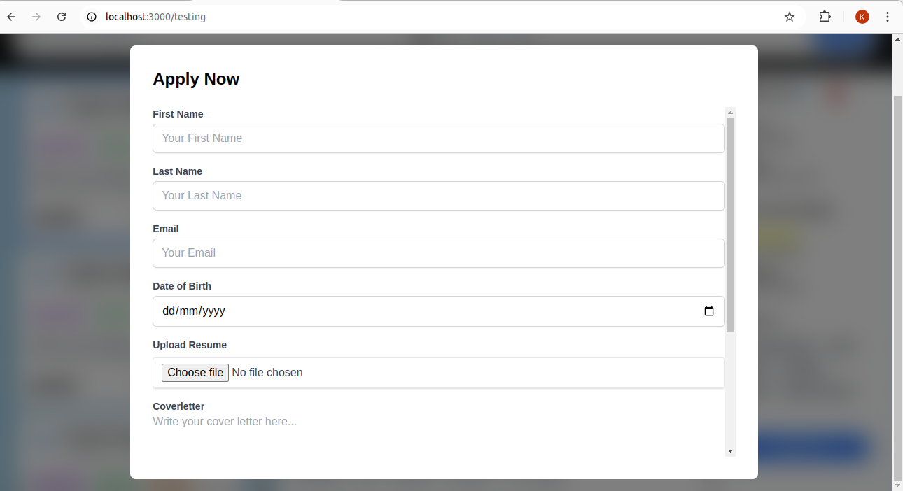

# Job Website Frontend

This is a **Job Website Frontend** built with **Next.js** and **Tailwind CSS**. The website consists of three main pages: a landing page, a job listing page with job cards, and a job details page. Users can view job details and apply for jobs using a modal form.

## Features

- **Landing Page**: Provides an overview of the website.
- **Job Listing Page**: Displays job cards with company names, salaries, and posting dates.
- **Job Details Page**: Shows detailed information about a selected job.
- **Apply Now Modal**: A modal form allows users to enter their details and submit a job application.

## Pages

### 1. **Landing Page**

- The homepage of the website.
- Provides an introduction and overview of the job board.

### 2. **Job Listing Page**

- Displays job cards with the following details:
  - **Company Name**
  - **Salary**
  - **Posted Date**
- Features a sidebar for navigation.
- Clicking on a job card redirects the user to the job details page.

### 3. **Job Details Page**

- Shows comprehensive details about the selected job.
- Includes an **Apply Now** button.
- Clicking the **Apply Now** button opens a modal form.

## Technologies Used

- **[Next.js](https://nextjs.org/)**: For server-side rendering and frontend development.
- **[Tailwind CSS](https://tailwindcss.com/)**: For styling and responsiveness.
- **JavaScript**: For dynamic interactions like modal functionality.

# How to Use

## Landing Page:

- Explore the introduction and features of the job website.

## Job Listing Page:

- View job cards with details like company name, salary, and posting date.
- Click on a job card to view detailed job information.

## Job Details Page:

- Review the job details.
- Click the Apply Now button to open a modal.
- Fill out the form with your details and submit your application.

## Apply Now Modal:

- Opens a modal form upon clicking the **Apply Now** button.
- Form fields include:
  - Full Name
  - Email Address
  - Phone Number
  - Cover Letter (optional)
- A user-friendly submission process to apply for jobs.

## Landing Page

<!--  -->

## Job Listing Page

## Job Details

## Modal

